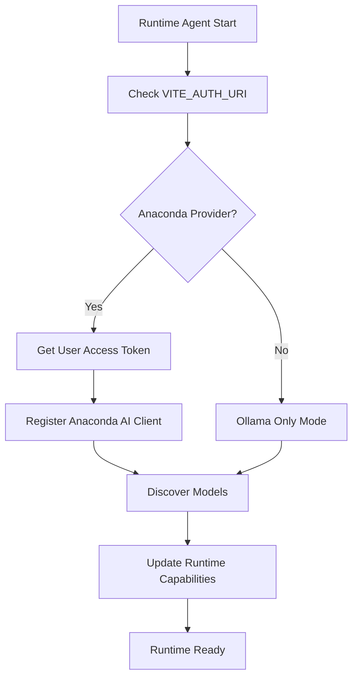
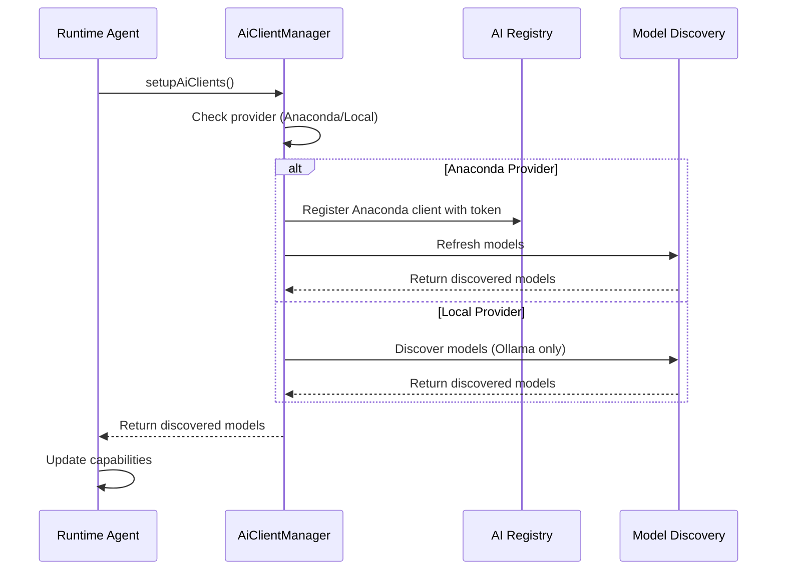

# AI Client Integration for Runtime Agents

This document summarizes the AI client integration feature that provides automatic AI model discovery and authentication for runtime agents in the Anode system.

## Overview

The AI client integration feature enables runtime agents to automatically detect and configure AI providers based on deployment environment, providing seamless access to AI models without manual configuration.

### Key Components

1. **AiClientManager** - Reusable utility for AI client setup
2. **Anaconda Provider Detection** - Automatic detection via build-time environment variables
3. **Authentication Integration** - Uses existing user session tokens
4. **Model Discovery** - Dynamic discovery of available AI models
5. **Cross-Runtime Reusability** - Shared patterns for any runtime agent type

## Architecture

### Provider Detection Logic

The system determines which AI provider to use based on the `VITE_AUTH_URI` environment variable:

```typescript
private isUsingAnacondaProvider(): boolean {
  const authUri = import.meta.env.VITE_AUTH_URI;
  return authUri?.startsWith("https://auth.anaconda.com/") ?? false;
}
```

**Detection Rules:**
- **Anaconda**: `VITE_AUTH_URI` starts with `https://auth.anaconda.com/`
- **Local Development**: All other configurations (Ollama only)

### Authentication Flow



### Model Discovery Timeline



## Implementation

### AiClientManager Class

The `AiClientManager` provides centralized AI client management:

```typescript
export class AiClientManager {
  constructor(authTokenOrConfig: string | AiClientManagerConfig);
  
  // Main setup method - call during runtime startup
  async setupAiClients(): Promise<void>;
  
  // Model management
  async refreshModels(): Promise<void>;
  getDiscoveredModels(): AiModel[];
  
  // Client registration
  registerAIClient(provider: "anaconda" | "openai", config: Config): void;
  
  // Status queries
  hasModels(): boolean;
  getAvailableProviders(): string[];
  hasProvider(provider: string): boolean;
}
```

### Integration in Runtime Agents

#### 1. Setup in Constructor

```typescript
export class MyRuntimeAgent extends LocalRuntimeAgent {
  private aiManager: AiClientManager;
  private discoveredModels: AiModel[] = [];

  constructor(config: LocalRuntimeConfig) {
    super(config);
    this.aiManager = new AiClientManager(config.authToken);
  }
}
```

#### 2. Startup Integration

```typescript
async start(): Promise<RuntimeAgent> {
  // Setup AI clients automatically
  await this.aiManager.setupAiClients();
  
  // Get discovered models for capabilities
  this.discoveredModels = this.aiManager.getDiscoveredModels();
  
  // Parent start() will announce capabilities including AI models
  return await super.start();
}
```

#### 3. Capabilities Integration

```typescript
protected getCapabilities(): RuntimeCapabilities {
  return {
    canExecuteCode: true,
    canExecuteSql: false,
    canExecuteAi: true,
    availableAiModels: this.discoveredModels, // ← Models from manager
  };
}
```

## Usage Examples

### HTML Runtime Agent

```typescript
// Automatic setup - no configuration needed
const htmlAgent = new HtmlRuntimeAgent(config);
await htmlAgent.start();

// AI models are automatically discovered and available
const capabilities = htmlAgent.getCapabilities();
console.log(`Found ${capabilities.availableAiModels?.length} AI models`);
```

### Python Runtime Agent (Example)

```typescript
const pythonAgent = new ExamplePythonAgent(config);
await pythonAgent.start();

// Check AI status
const aiStatus = pythonAgent.getAIStatus();
console.log(`AI Status:`, {
  models: aiStatus.modelsCount,
  providers: aiStatus.providers,
  hasAnaconda: aiStatus.hasAnaconda
});
```

### Manual Client Registration

```typescript
// Register additional providers after startup
agent.registerAIClient("openai", { apiKey: "sk-..." });
await agent.refreshAIModels();
```

## Configuration Options

### AiClientManager Configuration

```typescript
const aiManager = new AiClientManager({
  authToken: "user-access-token",
  discoverModelsOnSetup: true,  // Auto-discover models during setup
  enableLogging: true,          // Console progress logging
});
```

### Environment Variables

| Variable | Purpose | Example |
|----------|---------|---------|
| `VITE_AUTH_URI` | Provider detection | `https://auth.anaconda.com/` |
| `RUNT_API_KEY` | Local development | User's local API key |

## Benefits

### For Developers

- **Zero Configuration**: Automatic setup based on deployment environment
- **Consistent Patterns**: Same integration across all runtime agent types
- **Type Safety**: Full TypeScript support with proper type inference
- **Error Handling**: Graceful fallbacks when authentication fails

### For Users

- **Seamless Experience**: AI models appear automatically when authenticated
- **No Manual Setup**: Works out-of-the-box on Anaconda platform
- **Offline Capability**: Always includes Ollama for local development
- **Real-time Discovery**: Models refresh when authentication changes

### For Operations

- **Environment Agnostic**: Same code works in dev/staging/production
- **Secure by Default**: Uses existing authentication tokens
- **Observable**: Clear logging of setup progress and failures
- **Scalable**: Registry pattern supports multiple providers

## Technical Decisions

### Why Build-Time Detection?

Using `VITE_AUTH_URI` for provider detection provides:

- **Reliability**: No runtime network calls required
- **Performance**: Immediate detection without API latency
- **Simplicity**: Single environment variable check
- **Build Optimization**: Vite can optimize based on static values

### Why Access Token vs API Keys?

Using user access tokens directly:

- **Simplicity**: No additional API key management required
- **Security**: Leverages existing authentication flow
- **Consistency**: Same tokens used throughout the application
- **Flexibility**: Backend can convert tokens as needed

### Why Registry Pattern?

The AI client registry enables:

- **Dynamic Registration**: Add providers at runtime
- **Factory Pattern**: Clean separation of client creation
- **Extensibility**: Easy to add new providers
- **Testing**: Mock providers for testing

## Future Enhancements

### Planned Features

1. **Multiple Provider Support**: Register multiple providers simultaneously
2. **Model Preferences**: User preferences for default models
3. **Provider Health Checking**: Monitor provider availability
4. **Caching**: Cache model discovery results

### Extensibility Points

1. **Custom Providers**: Add support for additional AI providers
2. **Authentication Methods**: Support different authentication flows
3. **Model Filtering**: Filter models based on capabilities or user preferences
4. **Monitoring**: Add metrics and observability

## Migration Guide

### From Manual AI Setup

**Before:**
```typescript
// Manual client registration
import { aiRegistry, AnacondaAIClient } from "@runtimed/ai-core";

aiRegistry.register("anaconda", () => 
  new AnacondaAIClient({ apiKey: "..." })
);
const models = await discoverAvailableAiModels();
```

**After:**
```typescript
// Automatic setup via AiClientManager
const aiManager = new AiClientManager(authToken);
await aiManager.setupAiClients();
const models = aiManager.getDiscoveredModels();
```

### For New Runtime Agents

1. **Extend LocalRuntimeAgent**: Use the common base class
2. **Add AiClientManager**: Initialize in constructor
3. **Call setupAiClients()**: In your start() method
4. **Update Capabilities**: Include discovered models

```typescript
export class MyRuntimeAgent extends LocalRuntimeAgent {
  private aiManager = new AiClientManager(this.config.authToken);
  
  async start() {
    await this.aiManager.setupAiClients();
    this.discoveredModels = this.aiManager.getDiscoveredModels();
    return await super.start();
  }
}
```

## Testing

### Local Development

```bash
# Start with Ollama (local provider)
VITE_AUTH_URI=http://localhost:8787/local_oidc pnpm dev

# Start with Anaconda (requires auth)
VITE_AUTH_URI=https://auth.anaconda.com/ pnpm dev
```

### Debugging

```typescript
// Check AI manager status
const status = {
  models: aiManager.getDiscoveredModels().length,
  providers: aiManager.getAvailableProviders(),
  hasAnaconda: aiManager.hasProvider("anaconda"),
};
console.log("AI Status:", status);
```

## Troubleshooting

### Common Issues

1. **"No AI models discovered"**
   - Check if Ollama is running (local dev)
   - Verify authentication (Anaconda)
   - Check console for setup errors

2. **"Anaconda client not registered"**
   - Verify `VITE_AUTH_URI` starts with `https://auth.anaconda.com/`
   - Check user authentication status
   - Verify access token validity

3. **Models not refreshing**
   - Call `refreshModels()` after registering new clients
   - Check network connectivity for model discovery
   - Verify API key permissions

### Debug Commands

```typescript
// Check provider detection
const isAnaconda = authUri?.startsWith("https://auth.anaconda.com/");
console.log("Provider:", isAnaconda ? "Anaconda" : "Local");

// Check discovered models
console.log("Models:", aiManager.getDiscoveredModels());

// Check registry
console.log("Providers:", aiManager.getAvailableProviders());
```

## Summary

The AI Client Integration feature provides a robust, reusable system for automatic AI model discovery and authentication across runtime agents. It eliminates manual configuration while maintaining flexibility and providing clear fallback behavior for all deployment environments.

Key achievements:
- ✅ Zero-configuration AI setup based on deployment environment
- ✅ Reusable patterns across multiple runtime agent types  
- ✅ Secure authentication using existing user sessions
- ✅ Graceful fallbacks to ensure reliability
- ✅ Type-safe implementation with comprehensive error handling
- ✅ Clear documentation and examples for future development